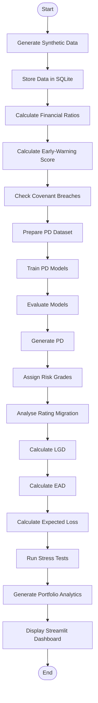

# Corporate Credit Early Warning & Expected Loss Analytics System

## About the Project

This project is a corporate credit risk analytics system developed as a final year academic project. It helps identify borrowers who may be facing financial difficulties and estimates their potential credit risk.

The system combines financial statements, loan details, repayment behaviour and economic data to analyse borrower health and calculate:

* Early warning risk scores
* Probability of Default (PD)
* Risk grades
* Rating migration
* Loss Given Default (LGD)
* Exposure at Default (EAD)
* Expected Loss (EL)
* Macro stress test results

The project uses synthetic data and is designed for academic and demonstration purposes.

---

## Main Workflow

```text
Financial Data
      ↓
Financial Ratios
      ↓
Early-Warning Score
      ↓
PD Model
      ↓
Risk Grade
      ↓
LGD + EAD
      ↓
Expected Loss
      ↓
Stress Testing
      ↓
Dashboard
```

---

## System Architecture

```text
┌──────────────────────┐
│   Synthetic Data     │
│  Borrowers / Loans   │
│ Behaviour / Economy  │
└──────────┬───────────┘
           ↓
┌──────────────────────┐
│     SQLite DB        │
└──────────┬───────────┘
           ↓
┌──────────────────────┐
│ Financial Ratios     │
│ & Trends             │
└──────────┬───────────┘
           ↓
┌──────────────────────┐
│ Early Warning System │
└──────────┬───────────┘
           ↓
┌──────────────────────┐
│     PD Models        │
│ Logistic Regression  │
│ Gradient Boosting    │
└──────────┬───────────┘
           ↓
┌──────────────────────┐
│ Risk Grade &         │
│ Rating Migration     │
└──────────┬───────────┘
           ↓
      ┌────┴────┐
      ↓         ↓
    LGD         EAD
      └────┬────┘
           ↓
┌──────────────────────┐
│    Expected Loss     │
│     PD × LGD × EAD   │
└──────────┬───────────┘
           ↓
┌──────────────────────┐
│   Stress Testing     │
│ Baseline / Moderate  │
│       / Severe       │
└──────────┬───────────┘
           ↓
┌──────────────────────┐
│ Streamlit Dashboard  │
└──────────────────────┘
```

---

## Activity Diagram



---

## Key Features

### Early Warning

The system calculates a 0–100 deterioration score using:

* Leverage
* Liquidity
* Interest coverage
* Revenue growth
* Cash flow
* Repayment behaviour

Risk is grouped into:

| Score  | Status   |
| ------ | -------- |
| 0–24   | Stable   |
| 25–49  | Watch    |
| 50–74  | Elevated |
| 75–100 | Critical |

### PD Modelling

Two models are used:

* Logistic Regression
* Gradient Boosting

Models are evaluated using:

* ROC-AUC
* Gini
* KS
* Brier Score

### Expected Loss

The project uses:

```text
Expected Loss = PD × LGD × EAD
```

EAD is calculated using:

```text
EAD = Drawn Exposure + CCF × Undrawn Exposure
```

---

## Stress Testing

The system includes three scenarios:

```text
Baseline
   ↓
Moderate
   ↓
Severe
```

Economic changes are passed through financial ratios, early-warning indicators and the PD model before calculating the stressed Expected Loss.

---

## Dashboard

The Streamlit dashboard contains five sections:

1. Portfolio Overview
2. Borrower Early Warning
3. Facility Risk Analytics
4. Rating Migration
5. Macro Stress Testing

---

## Project Structure

```text
corporate-credit-risk/
│
├── README.md
├── requirements.txt
├── run.py
├── create_zip.py
│
├── database/
│   └── schema.sql
│
├── src/
│   ├── data/
│   │   └── generator.py
│   │
│   ├── features/
│   │   └── financial_ratios.py
│   │
│   └── risk/
│       ├── early_warning.py
│       ├── pd_model.py
│       ├── lgd_ead_el.py
│       └── stress_testing.py
│
└── dashboard/
    └── app.py
```

---

## Technologies Used

* Python 3.10+
* SQLite
* Pandas
* NumPy
* Scikit-learn
* Statsmodels
* Plotly
* Streamlit

---

## How to Run

Install the required packages:

```bash
pip install -r requirements.txt
```

Run the project:

```bash
python run.py
```

The system will generate the data, build the risk models, calculate the risk measures and launch the Streamlit dashboard.

To build the system without opening the dashboard:

```bash
python run.py --no-dashboard
```

---

## Academic Scope

This project uses synthetic data and simplified assumptions for academic purposes. The risk scores, model outputs, collateral assumptions, CCFs and stress scenarios are project-defined.

It is intended for **learning, demonstration and final-year project evaluation**, not for real-world lending or regulatory decision-making.

---

## Conclusion

This project demonstrates how financial data, borrower behaviour and economic conditions can be combined to understand corporate credit risk. It brings together early-warning analysis, PD modelling, LGD, EAD, Expected Loss, rating migration and stress testing in one simple analytical system.
